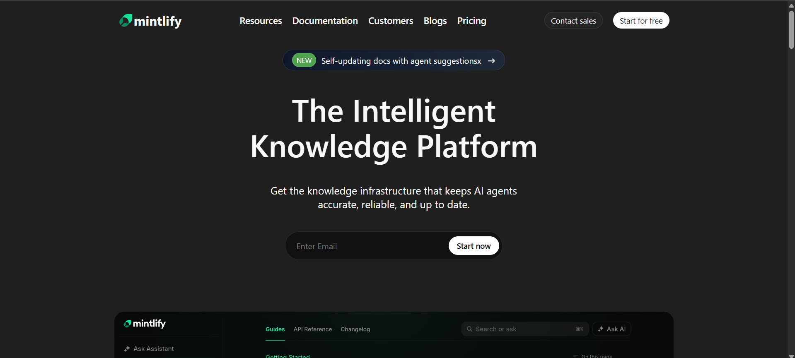
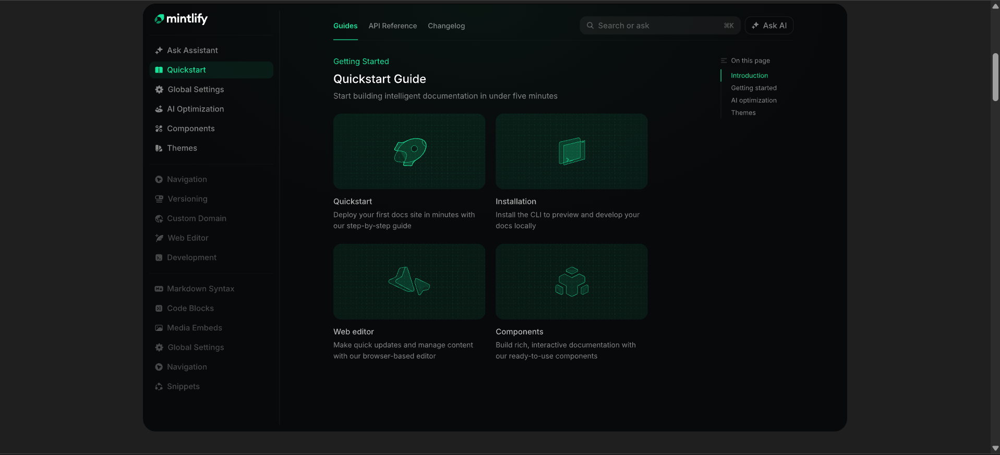
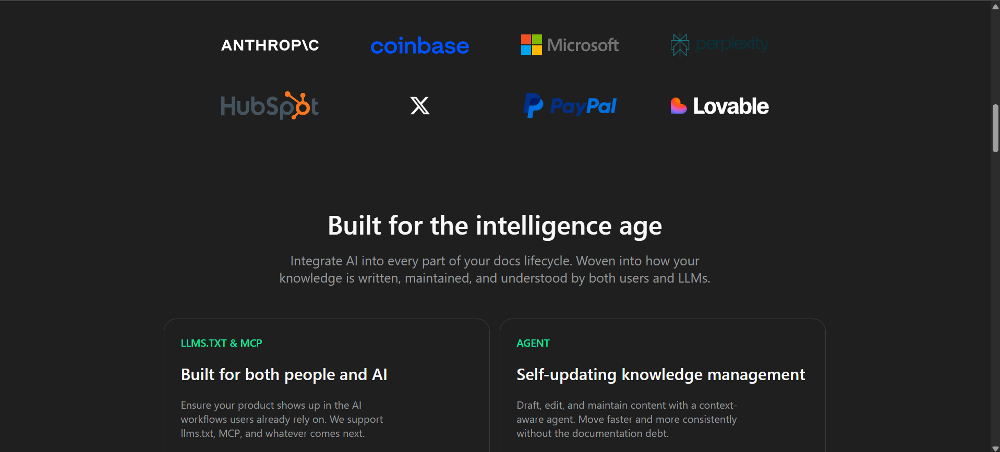
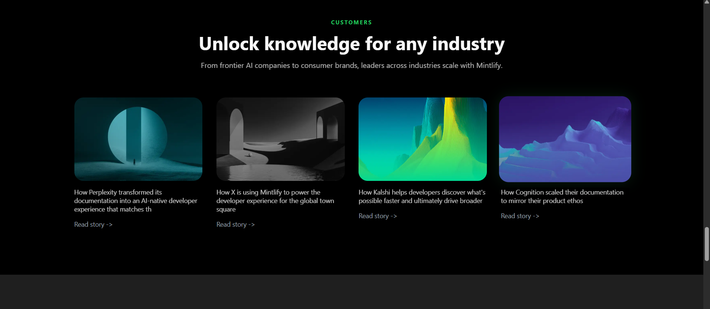
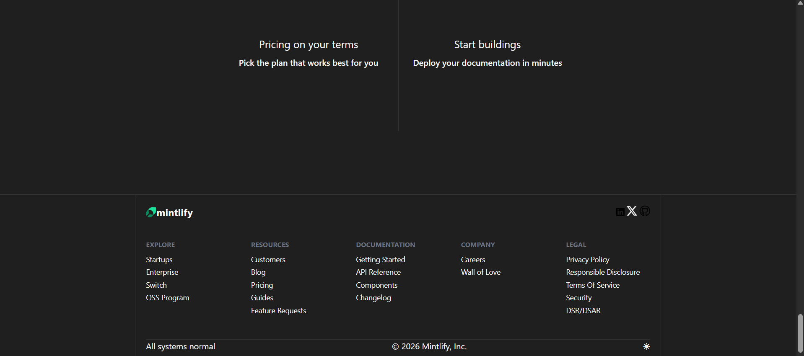

# Mintlify Landing Page Clone

A **Mintlify Website Landing Page Clone** built using **HTML** and **CSS**.  
This project recreates the UI/UX of the Mintlify homepage for learning and practice purposes.

---

## 🚀 Live Demo
https://glowing-banoffee-0c1773.netlify.app/

---

## 📌 Features

- Responsive Navigation Bar
- Hero Section with CTA
- Brand Logo Grid
- Feature Cards
- Enterprise Section
- Customer Stories Section
- CTA (Call To Action) Area
- Footer with Grid Layout
- Dark Theme UI
- Clean and Modern Design

---

## 🛠️ Tech Stack

- **HTML**
- **CSS (Flexbox & Grid)**
- No JavaScript (Pure UI Clone)

---

## How to run the project
1. Download or Clone the repository
   ```bash
   git clone https://github.com/abhi-webdev/CHAI-COHOT-2026/tree/main/CSS/Mintlify
   ```

2. Open the folder
3. Double-click index.html
or open with Live Server in VS Code.

## Screenshot





