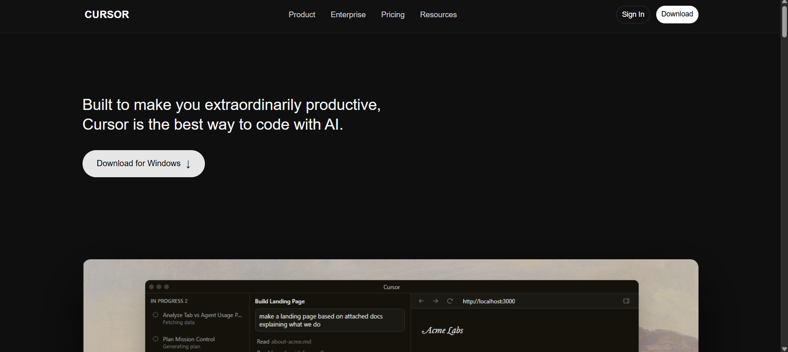
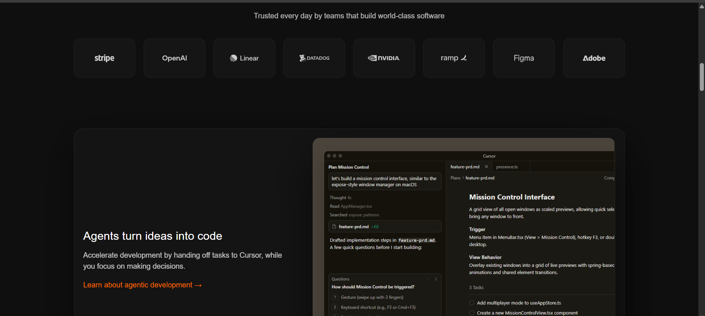
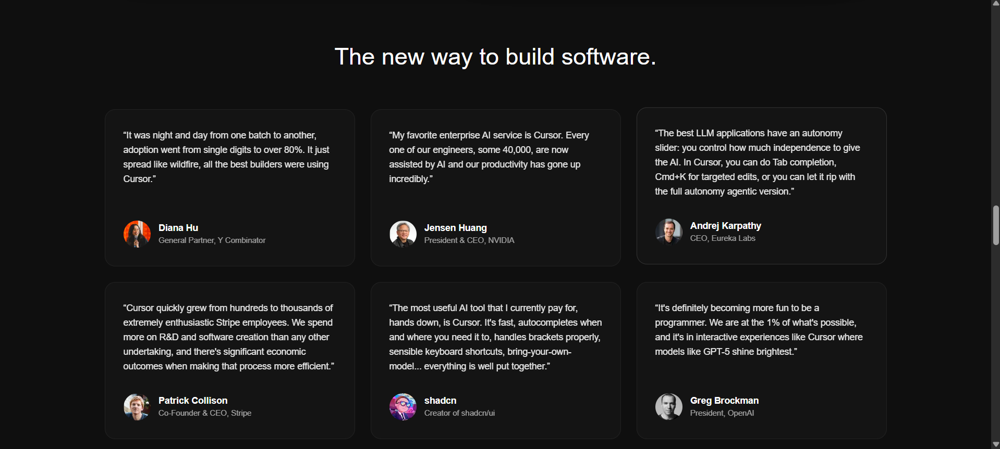
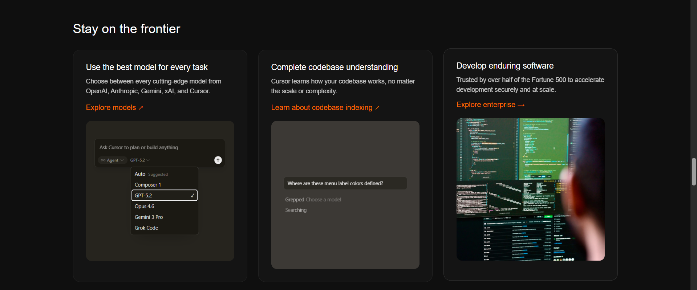
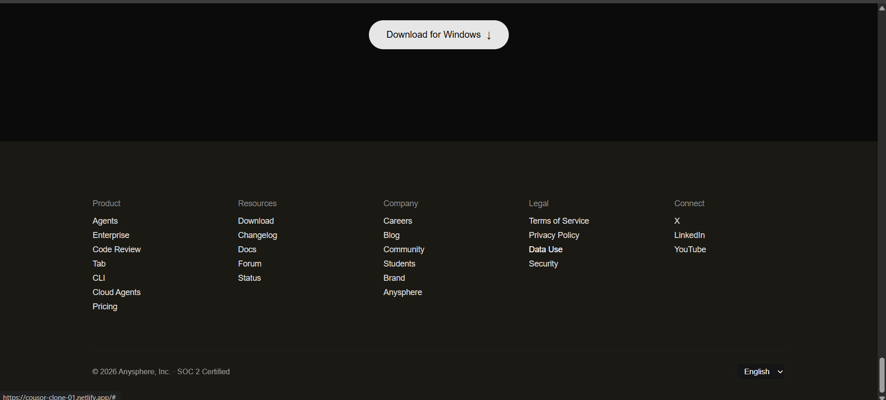

# Cursor Landing Page Clone

A static **Cursor Website UI Clone** built using **HTML & CSS only**.  
This project recreates the main landing page layout of the Cursor website including navbar, hero section, features, testimonials, changelog, blog highlights, CTA, and footer.

---

## 🚀 Features

- Dark modern UI
- Responsive-style layout (desktop focused)
- Navigation bar
- Hero section with download button
- Trusted companies logo grid
- Feature showcase sections
- Testimonials / Quotes cards
- Changelog cards
- Blog / Recent highlights section
- Final Call-To-Action section
- Multi-column footer

---

## 🛠 Tech Stack

- **HTML5**
- **CSS3**
- No frameworks
- No JavaScript

---
## 📷 Sections Included

1. **Navbar**
2. **Hero Section**
3. **Trusted By Logos**
4. **Feature Sections**
5. **Testimonials**
6. **Stay on the Frontier**
7. **Changelog**
8. **Recent Highlights**
9. **Final CTA**
10. **Footer**

## Live Demo
https://cousor-clone-01.netlify.app/

## ▶ How to Run

1. Download or clone the repository
```
https://github.com/abhi-webdev/CHAI-COHOT-2026/tree/main/CSS/cursor
```
2. Open the project folder
3. Double-click `index.html`  
   OR  
   Open with **Live Server** in VS Code

## Screenshot




