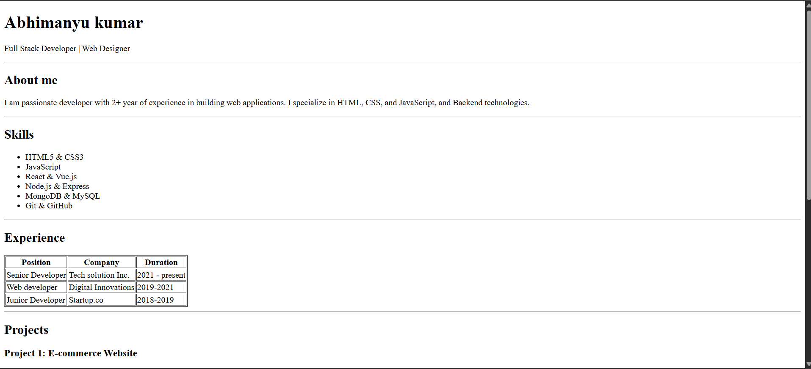
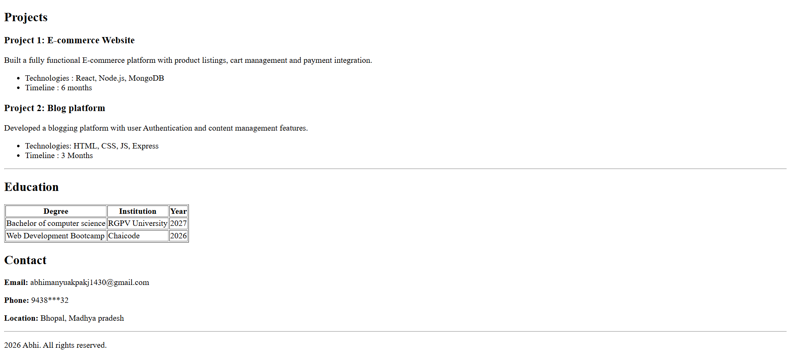

# HTML Resume Page
## Project description

This project is a **single-page resume website** built using **pure HTML** as part of the **web-dev cohot 2026 - HTML Resume page assignment**

The resume includes: 
- Header with Name and Role
- About Me section 
- Skills list 
- Experience table
- Projects section 
- Education Table
- Contact Me and Footer section

---
## Technologies used
- HTML

## How to run the project
1. clone the repository: 
```bash 
git clone https://github.com/abhi-webdev/CHAI-COHOT-2026.git 
```
2. Open the project folder 
3. Double click the `Resume.html` file

## Screenshot

